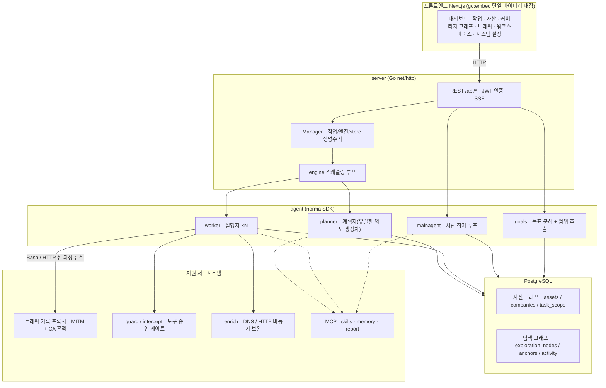
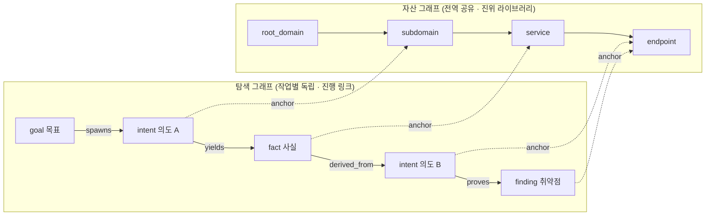
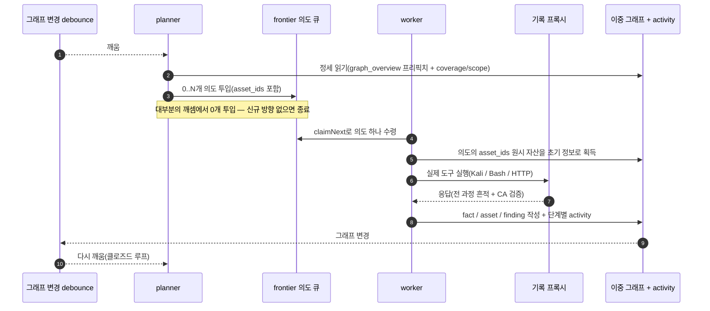
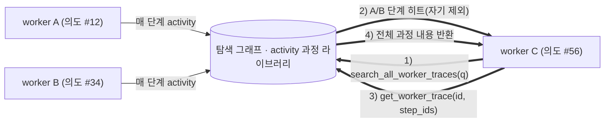
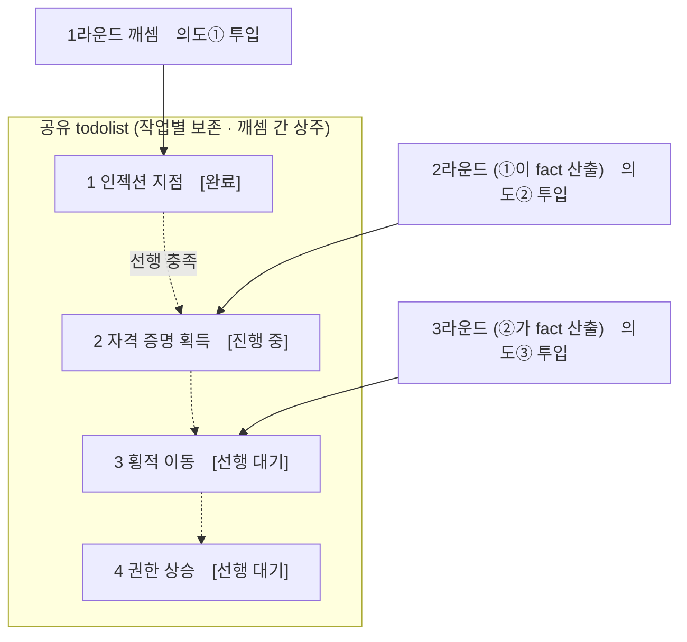

<div align="center">

# ARTEX

AI 자율 침투 테스트 시스템 (Go 백엔드 + Next.js 프론트엔드)

🌐 **온라인 데모**: [https://artex-demo.vercel.app/](https://artex-demo.vercel.app/)

</div>

---

## 스크린샷 미리보기

> 전체 인터랙션은 [온라인 데모](https://artex-demo.vercel.app/)에서 확인하세요.

| 대시보드 (종합 / Token 소비 / 활동 스트림) | 작업 목록 |
| :---: | :---: |
|  |  |

| 작업 · 실행 과정 (세션 / 도구 호출) | 탐색 링크 |
| :---: | :---: |
|  |  |

| 발견(Finding) | 자산 |
| :---: | :---: |
|  |  |

| 자산 커버리지 그래프 (포스 레이아웃 · 테스트 완료 강조 · 노드 접기/펼치기) |
| :---: |
|  |

| 트래픽 기록 | 사람 참여(Human-in-the-loop) 대화 |
| :---: | :---: |
|  |  |

| Agent 관리 | LLM 설정 |
| :---: | :---: |
|  |  |

| 인터셉트 승인 | 백엔드 로그 |
| :---: | :---: |
|  |  |


---

## 승인 기록 상세

전역 「승인 기록」, 작업 내 「인터셉트 승인」 및 대화 내 승인 카드는 모두 펼쳐서 상세를 확인할 수 있습니다. 표시 구조는 [AegisHook의 승인 상세 컴포넌트](https://github.com/RuoJi6/AegisHook/blob/main/web/src/components/CallDetail.vue)를 참고하되, ARTEX의 컴포넌트와 테마를 그대로 따릅니다:


## 자산 동기화 (ScopeSentry)

[ScopeSentry](https://github.com/Autumn-27/ScopeSentry)에서 자산 데이터를 직접 동기화할 수 있어 중복 수집이 필요 없습니다:

- 「**자산 동기화**」 페이지에 ScopeSentry 주소와 API Key를 입력해 데이터 소스 연결;
- **프로젝트** 또는 **작업** 단위로 동기화할 대상과 자산 유형(도메인 / 서브도메인 / IP / 포트 / 사이트 / 엔드포인트…) 선택;
- 원클릭 가져오기 후 회사 자산 범위 기준으로 병합되어, 바로 ARTEX의 자산 그래프에서 agent 탐색에 사용 가능.

---

## 설치

> 데이터베이스 **PostgreSQL** 필요; 탐색에는 **LLM** 설정(`ANTHROPIC_API_KEY` 또는 `OPENAI_API_KEY`, UI에서도 설정 가능)이 필요합니다.

### 방법 1: 원클릭 설치 스크립트 (권장)

```bash
git clone https://github.com/Autumn-27/ARTEX.git
cd ARTEX
./install.sh
```

스크립트가 할 일: Docker 감지 / 자동 설치 → **① 전체 Docker** 또는 **② 로컬 컴파일 실행** 선택:

- **① 전체 Docker**: Postgres 비밀번호 입력(엔터 시 랜덤) → 자동으로 `.env` 작성 → `docker compose up -d`.
- **② 로컬 실행**: 데이터베이스 선택(기존 연결 / Docker로 신규 기동) → `config.json` 생성 → `go`로 프론트 내장 단일 바이너리 컴파일 → 시작.

설치 후 **http://localhost:8787** 접속(최초 진입 시 `/setup`에서 관리자 비밀번호 설정).

### 방법 2: Docker Compose (수동)

```bash
git clone https://github.com/Autumn-27/ARTEX.git
cd ARTEX
cp .env.example .env          # POSTGRES_PASSWORD, 선택지로 ANTHROPIC_API_KEY 입력
docker compose up -d          # autumn27/artex 이미지 + postgres 기동
# → http://localhost:8787
```

이미지에 일반 도구 포함(ripgrep/curl/vim/npm/nmap…); `./skills`와 `./data`는 바인드 마운트로 영속화.

원격 MCP는 시스템 설정에서 `http`(Streamable HTTP) 또는 `sse`(구버전 SSE) 선택 가능.
구버전 SSE 서비스는 보통 `GET /sse`로 이벤트 스트림을 확립한 뒤, 서비스가 반환하는
`/message?sessionId=...`로 JSON-RPC 요청을 수신합니다; 설정 시 URL은 `/sse`로 입력하고, 요청 헤더는
`Authorization=Bearer <token>` 형식으로 입력하세요.

### 방법 3: 사전 컴파일 바이너리 다운로드 (Releases)

[Releases](https://github.com/Autumn-27/ARTEX/releases)에서 해당 플랫폼의 zip을 다운로드한 뒤 압축을 해제하면 `artex` + `start.sh`(Windows는 `start.bat`) + `skills/` + `config.example.json`이 생성됩니다:

```bash
cp config.example.json config.json   # database 연결 정보 입력
./start.sh                           # → http://localhost:8787
```

> `./artex`를 직접 실행하지 말고 반드시 `start.sh` / `start.bat`으로 시작하세요. 이 스크립트는 데몬 역할입니다: 프로그램 종료 후 종료 코드에 따라 재기동 여부를 결정하며, **페이지의 [원클릭 업데이트](#방법-1페이지-원클릭-업데이트-권장)가 이 스크립트로 교체 완료**됩니다. `./artex`를 직접 실행하면 업데이트 후 재기동되지 않습니다.
> 백그라운드 상주: `nohup ./start.sh >artex.log 2>&1 &`.

### 방법 4: 소스에서 단일 바이너리 컴파일

```bash
# 1) 프론트엔드 정적 내보내기
cd web && npm ci && npm run build:static && cd ..
# 2) 내장 디렉터리로 복사
cp -r web/out server/webui/dist
# 3) 컴파일(-tags embedui로 프론트엔드 내장)
CGO_ENABLED=0 go build -tags embedui -o artex ./cmd/artex
./start.sh
```

### 방법 5: 크로스 플랫폼 Release zip 패키지 빌드

`build.sh`는 먼저 프론트엔드를 빌드·내장한 뒤, Go linker로 디버그 정보를 제거하고 릴리스 파일을 zip으로 압축합니다. Release 모드는 기본적으로 Linux amd64/arm64, macOS amd64/arm64, Windows amd64의 zip 패키지를 생성합니다:

```bash
./build.sh --release
# 산출물: dist/artex-0.3.3-*.zip
```

UPX 자기 해제 바이너리는 일부 Linux 커널, 가상화 환경 또는 보안 정책과 호환되지 않을 수 있어 기본 비활성화됩니다. `ARTEX_TARGETS`로 대상을 커스터마이징할 수 있으며, 대상 실행 환경 호환을 확인한 경우 `--upx`를 명시 전달해 바이너리를 추가로 축소할 수 있습니다:

```bash
ARTEX_TARGETS=linux/amd64,windows/amd64 ./build.sh --release
./build.sh --target linux/amd64 --upx
```

---

## 업데이트 및 업그레이드

> 업그레이드는 프로그램만 교체하고 데이터는 건드리지 않습니다: Postgres 데이터 볼륨 `pgdata`, `./data`(jwt.key / SQLite 등), `./skills` 모두 보존됩니다. **데이터베이스 마이그레이션은 수동 불필요** — `artex`가 매 시작 시 `schema.sql`을 멱등 재실행(`ADD COLUMN` / `CREATE INDEX IF NOT EXISTS` 포함), 즉 "재시작이 곧 마이그레이션"입니다. 업그레이드 전 `./data`와 데이터베이스 백업을 권장합니다.

### 방법 1: 페이지 원클릭 업데이트 (권장)

**시스템 설정** 페이지(사이드바 「시스템 설정」 → `/system/settings`)의 **버전 및 업데이트** 카드에서 새 버전을 바로 확인·설치할 수 있어 서버 로그인 불필요.

「업데이트」 클릭 후: 현재 플랫폼 릴리스 패키지 다운로드 → Release의 `SHA256SUMS` 비교 → `-h` 스모크 테스트로 새 바이너리 검증 → `artex.new`로 임시 저장 → 프로그램 종료, `start.sh` / `start.bat`이 재기동하며 교체 완료. 페이지는 새 버전 온라인 후 자동으로 갱신됩니다.

- **실패 시 잘못된 프로그램 잔존 없음**: 검증이나 스모크 테스트 실패 시 임시 파일을 폐기하고 현재 버전 유지; 교체 후 새 버전이 3회 연속 시작 실패하면 자동으로 `artex.old`로 롤백(실패한 바이너리는 조사용으로 `artex.failed` 보존).
- **언제든 되돌리기 가능**: 이전 버전은 `artex.old`로 보존되며, 카드에 「이전 버전으로 롤백」 버튼 제공. 단, 데이터베이스 구조는 롤백되지 않습니다.
- **업데이트는 실행 중인 작업을 중단합니다** — 업데이트는 곧 재시작이므로 유휴 시간에 진행하세요.
- **개발 빌드에는 업데이트 없음**: 버전 번호가 `dev`이거나 `git describe` 접미사가 있으면 비활성화되어, 정식 버전이 로컬 디버그 바이너리를 덮어쓰는 것을 방지합니다.
- **Docker 환경에서는 프로그램만 교체, 이미지는 그대로**: 이미지 내 playwright / nmap 등 도구 체인은 함께 업그레이드되지 않으며, `docker compose up -d`로 컨테이너를 재빌드하면 이미지에 내장된 버전으로 되돌아갑니다. 이미지까지 함께 업그레이드하려면 `docker compose pull artex && docker compose up -d artex`를 사용하세요.
- GitHub 접근에 프록시가 필요한 경우 같은 페이지에서 **전역 프록시**를 설정하면 업데이트 경로가 이를 거칩니다. 업데이트는 GitHub 도메인에서만 다운로드하며 HTTPS를 강제합니다.

### 방법 2: 원클릭 업데이트 스크립트

```bash
cd ARTEX
./update.sh
```

스크립트는 먼저 선택지로 `git pull`을 실행해 최신 코드를 가져온 뒤, **① Docker 업데이트** 또는 **② 로컬 컴파일 업데이트**(`install.sh`와 대응)를 선택합니다:

- **① Docker**: 대상 이미지 tag 지정 가능(엔터 시 `.env`의 `ARTEX_TAG` 유지, 기본값 `latest`) → `docker compose pull` → `docker compose up -d`(새 이미지 재시작 시 자동 마이그레이션).
- **② 로컬**: 프론트엔드 정적 산출물 재빌드 → `./artex` 재컴파일(완료 후 프로세스 재시작으로 반영).

### 방법 3: Docker Compose (수동)

```bash
cd ARTEX
git pull                       # compose / 스크립트 업데이트(선택)
# 버전 지정: .env에서 ARTEX_TAG=v0.2.0 설정; 미설정 시 latest 사용
docker compose pull artex
docker compose up -d artex     # 새 이미지 재시작 → schema 자동 마이그레이션
docker image prune -f          # 구 이미지 정리(선택)
```

### 방법 4: 사전 컴파일 바이너리 (Releases)

[Releases](https://github.com/Autumn-27/ARTEX/releases)에서 새 버전 zip을 다운로드한 뒤 기존 프로세스를 중지하고 `artex`와 `skills/`를 덮어쓴 후(`config.json`과 `data/`는 보존), 재시작하면 됩니다:

```bash
cp -r <압축해제디렉터리>/skills ./ && cp <압축해제디렉터리>/artex ./
./start.sh
```

### 방법 5: 소스에서 컴파일

```bash
git pull
cd web && npm ci && npm run build:static && cd ..
cp -r web/out server/webui/dist
CGO_ENABLED=0 go build -tags embedui -o artex ./cmd/artex
# ./start.sh 재시작
```

---

## 설정

**데이터베이스**(`config.json`, 또는 환경 변수 `ARTEX_PG_DSN`으로 덮어쓰기):

```json
{
  "database": {
    "host": "127.0.0.1", "port": 5432,
    "user": "artex", "password": "yourpass",
    "dbname": "artex", "sslmode": "disable"
  }
}
```

**LLM**: `export ANTHROPIC_API_KEY=sk-...`(또는 `OPENAI_API_KEY`), UI의 「LLM 설정」 페이지에서 입력해도 됩니다.
선택지: `ARTEX_LLM_PROVIDER` / `ARTEX_LLM_MODEL` / `ARTEX_LLM_BASE_URL` / `ARTEX_LLM_PROXY`.

**동시성**: 각 작업의 work agent 수는 「시스템 설정」에서 구성(기본값 3).

**일반 파라미터**: `./start.sh -addr :8787 -proxy :8788`(`-addr`은 프론트엔드+API, `-proxy`는 트래픽 기록 프록시). 시작 스크립트는 파라미터를 그대로 `artex`에 전달합니다.

### 리버스 프록시 배포 (HTTPS / 443만 개방)

프론트엔드와 API/SSE 모두 동일한 백엔드 포트(기본 `:8787`)에서 제공되며, 실시간 활동 스트림은 기본적으로 **동일 출처** 주소를 사용하므로 **`NEXT_PUBLIC_SSE_BASE` 설정이 불필요**하고, 공인 네트워크에는 443만 개방한 뒤 8787을 내부망에 두면 됩니다.

SSE는 장시간 연결 + 지속 푸시이므로 리버스 프록시는 **반드시 버퍼링을 꺼야** 합니다. 그렇지 않으면 브라우저가 연결되어도 이벤트를 수신하지 못합니다(증상: 활동 스트림이 계속 로딩). Nginx 예시:

```nginx
server {
    listen 443 ssl;
    server_name your.domain.com;
    # ssl_certificate / ssl_certificate_key ...

    location / {
        proxy_pass http://127.0.0.1:8787;
        proxy_set_header Host $host;
        proxy_set_header X-Forwarded-Proto $scheme;

        # SSE 핵심 설정: 버퍼링 해제, 긴 타임아웃, HTTP/1.1
        proxy_buffering off;
        proxy_cache off;
        proxy_read_timeout 3600s;
        proxy_http_version 1.1;
        proxy_set_header Connection "";
    }
}
```

> SSE가 페이지와 다른 출처(예: 독립 서브도메인)로 가야 할 경우에만 **빌드 시점에** `NEXT_PUBLIC_SSE_BASE`를 설정하세요(이 변수는 `next build` 시 정적 패키지에 고정되며, 컨테이너 실행 후 설정해도 무효).

---


## 개발

### 수동 취약점 재테스트

작업 상세의 「재테스트」 탭에서 해당 작업의 취약점을 페이지별로 선택하고, 과거 결론과 증거를 확인하며, 수동으로 재테스트를 시작할 수 있습니다. 시작 후 현재 탭을 유지하고 로딩 아이콘과 「재테스트 중」 표시; 복구 확인 후 취약점 상태를 동기 업데이트합니다.

취약점 목록 각 행 작업 영역의 「재테스트」를 클릭하거나, 취약점 상세의 「취약점 재테스트」 영역에서 「재테스트 시작」을 클릭한 뒤, 선택지로 복구 버전 / 테스트 조건 / 제한 사항을 입력하면 시스템이 독립적인 재테스트 Agent 세션을 생성하고 시작 후 현재 페이지를 유지합니다. 목록의 평면 보기, 작업별 그룹핑 및 자산 뷰 모두 이 진입점을 지원하며, 재테스트 실행 중에는 로딩 아이콘과 「재테스트 중」을 표시하고 확인 필요 시 해당 세션으로 클릭 진입, 종료 후 「재테스트」로 복귀합니다. 재테스트는 원본 스캔 작업을 다시 시작할 필요 없으며, 결론은 「여전히 재현 가능」「복구 완료」「확인 불가」로 구분되고 매번의 결론·증거·세션 링크는 취약점 상세에 저장됩니다.

새 버전 백엔드는 최초 시작 시 편집 가능한 「취약점 재테스트」(`retester`) Agent를 프리셋하며, Agent 관리에서 프롬프트, LLM, 실행 예산 및 도구를 구성할 수 있습니다. 기본적으로 연결된 LLM을 사용하고, 미연결 시 전역 활성 설정을 사용합니다. 재테스트 세션이 정상 완료되고 결론이 「복구 완료」이면 시스템은 자동으로 취약점 처리 상태를 「복구 완료」로 변경합니다; 실행 중·실패·정지 또는 다른 결론은 원상태 유지. 원본 증거와 보고서는 항상 보존됩니다. 상태 드롭다운 메뉴에서 수동으로 「복구 완료」를 선택해도 됩니다. 동일 취약점이 재테스트 중이면 기존 세션을 재사용하며, 정지·실패 또는 서비스 재시작 후 다시 시작할 수 있습니다.

이번 버전의 이력 기록은 취약점 상세와 세션으로만 확인 가능하며, 아직 취약점 보고서 내보내기나 작업 아카이브 패키지에 포함되지 않았고 트래픽 패키지와도 자동 연결되지 않습니다. 데모 모드는 명확히 표기된 시뮬레이션 기록만 생성하며 실제 대상에 요청하지 않습니다.

### 로컬 실행 및 테스트

```bash
./dev.sh    # 백엔드(:8787) + 트래픽 프록시(:8788) + 프론트엔드 next dev(:5173) → http://localhost:5173
```

- 백엔드: `go run ./cmd/artex`(`-tags embedui` 없으면 프론트엔드 미내장)
- 프론트엔드: `cd web && npm run dev`(`/api`는 백엔드로 리버스 프록시, 핫릴로드 지원)
- 테스트: `go test ./...`
- Mock 미리보기(백엔드 없이): `cd web && NEXT_PUBLIC_MOCK=1 npm run dev`

---

## 시스템 기술 아키텍처

ARTEX는 **LLM 멀티 agent 기반 자율 침투 시스템**입니다: Go 단일 백엔드(Next.js 프론트엔드 내장) + PostgreSQL이며, agent 역량은 [`norma`](https://github.com/Autumn-27/norma) SDK가 제공합니다(`agentcore` / `tool` / `permission` / `harness` / `memory` / `transcript`). 핵심은 **이중 그래프 아키텍처**이며, 이를 둘러싼 두 가지 자율성 메커니즘은 **worker 간 과정 단위 정보 교환**과 **planner의 다중 라운드 공유 todolist 기반 안정적인 공격 링크**입니다.

### 전체 계층 구조



| 계층 | 역할 |
| --- | --- |
| **프론트엔드** | Next.js 정적 내보내기, `go:embed`로 단일 바이너리에 내장; 작업/자산/탐색 링크/커버리지 그래프 시각화, 사람 참여 대화 |
| **server** | `net/http` 라우팅 + JWT 인증 + SSE; `Manager`가 작업·엔진·DB store 생명주기 관리 |
| **engine** | 작업별 `plannerLoop` 1개 + worker goroutine N개; 의도 수령, 타임아웃/일시정지/drain |
| **agent** | goals / planner / worker / mainagent, `ToolSet`이 이중 그래프를 LLM 도구로 노출 |
| **db** | 이중 그래프의 Postgres 구현(pgx); schema는 `go:embed`로 매 시작 시 멱등 테이블 생성 |
| **지원** | 기록형 MITM 프록시, 승인 게이트, 비동기 보완, MCP/스킬/메모리/리포트 |

### 이중 그래프 아키텍처: 탐색 그래프 + 자산 그래프

시스템은 「**대상이 무엇인가**」와 「**어느 정도 테스트했는가**」를 서로 독립적이면서 앵커로 연결된 두 개의 그래프로 분리합니다:

- **자산 그래프(Asset Graph, 전역 공유)**: 작업을 가로지르는 동일한 자산 진위 라이브러리. 노드는 `root_domain / subdomain / ip / service / app / endpoint`이며 회사에 귀속; 도메인→서브도메인→서비스→엔드포인트의 부자 관계와 중복 제거 key는 전부 프로그램이 계산하고, agent는 원시 정보만 제출합니다.
- **탐색 그래프(Exploration Graph, 작업별 독립)**: 한 번의 작업 "사고 및 진행" 과정. 노드는 `goal(목표) / intent(의도) / fact(사실) / finding(취약점) / hint(힌트)`이며, `spawns / derived_from / yields / proves` 등의 간선으로 **계보 링크**를 이루고 "어떤 방향이 어떤 사실에서 파생되어 무엇을 산출했는가"에 답합니다.
- **두 그래프는 앵커로 연결**: `exploration_anchors(node_id, asset_id)`가 의도/사실/취약점을 구체적 자산에 고정 — 따라서 "탐색 방향"에서 어떤 자산을 타깃하는지 볼 수 있고, "특정 자산"에서 이번 작업 중 어떤 의도로 테스트되었고 어떤 사실이 도출되었는지 역추적할 수도 있습니다. 이는 **자산 테스트 커버리지**와 **자산 커버리지 그래프**(범위 내 자산 + 테스트 완료 강조)를 뒷받침합니다.



> 역할 분담: **planner**는 탐색 그래프 정세를 읽고 목표를 판단하며, 미커버 신규 방향이 있을 때만 **의도**를 frontier에 투입; **worker**는 **의도 하나**를 수령해 실제 도구로 실행한 뒤 새 자산/사실/취약점을 두 그래프에 작성하면 즉시 종료. 자산 그래프는 공유 사실이고, 탐색 그래프는 작업별 진행 링크입니다.

### 엔진과 의도 생명주기 (탐색 한 번의 클로즈드 루프)

엔진은 **이벤트 기반** 클로즈드 루프입니다: 그래프가 변하면 planner를 깨우고, planner가 의도를 투입하며, worker가 의도를 수령해 실행 후 작성하고, 작성이 다시 다음 라운드를 촉발합니다 — 목표가 증명(`prove_goal`)될 때까지.



### worker 간 과정 단위 정보 교환

심층 탐색에서 많은 가치 있는 관찰(어떤 오류 메시지, 어떤 응답 구간, 어떤 숨겨진 파라미터)은 한 worker의 **실행 과정**에 나타나지만 공식 fact로 작성되지는 않을 수 있습니다. 중복 작업을 피하고 링크상의 worker들이 서로의 경험 위에 설 수 있도록, worker는 **워크 간 과정 검색** 능력을 갖춥니다:

- `search_all_worker_traces(q)`: **본 작업의 다른 work 실행 과정**에서 키워드 검색(자기 의도의 단계는 자동 제외), 히트 항목에 `intent_id` 포함;
- `list_worker_traces` / `get_worker_trace(intent_id, step_ids=[…])`: 먼저 어떤 work가 실행되었는지 확인한 뒤, 특정 work의 구체적 몇 단계 전체 내용을 가져와 세부 교환 수행.

이로써 탐색 그래프에 해당 fact가 아직 없어도 이후 worker가 타인의 과정 관찰을 재사용할 수 있습니다 — **정보가 worker 간 "실행 과정" 단위로 흐르되**, 경계는 변하지 않습니다(각 worker는 여전히 자신이 수령한 의도만 수행).



### planner의 다중 라운드 공유 todolist → 안정적인 공격 링크

실제 공격 링크는 대개 **선후 dependencies가 있는 다단계 시퀀스**입니다(예: 인젝션 지점 발견 → 자격 증명 획득 → 횡적 이동 → 권한 상승). 이들을 한 번에 병렬 투입하면 혼란만 발생합니다. 그래서 planner는 **작업별 보존·깨셈 간 공유되는 계획 대기열(todolist)**을 보유합니다:

- planner는 이벤트 기반 — 그래프가 변하면 깨어나지만 **매 깨셈은 완전히 새로운 세션**; 공유 todolist 덕분에 직선형 이용 링크를 **한 번 기록**한 뒤 이후 여러 라운드에서 **의존성에 따라 단계별 의도 투입**이 가능하며, 링크 전체를 한 라운드에 전부 전개하지 않습니다;
- 매 라운드는 「선행 단계 완료, 그 의존 fact 존재」인 다음 단계에만 의도를 투입하고, 진행에 따라 목록을 갱신(fact로 충족된 단계를 완료 표시).



이렇게 공격 링크는 "이벤트 기반 + 상태 없는 세션" 환경에서도 **안정적으로 진행·중복 없음·순서 오류 없음**을 유지합니다 — ARTEX가 다단계 이용 링크를 자율적으로 완주할 수 있는 핵심입니다.

---

## 커뮤니티

WeChat 공식 계정 **SecSentry**를 스캔해 팔로우한 뒤, 계정에서 다이렉트 메시지를 보내면 입장 가능합니다.

<div align="center">


</div>

---
## 참고

https://github.com/oritera/Cairn


## 라이선스 및 면책 조항

### 오픈소스 라이선스

이 프로젝트는 **GNU Affero General Public License v3.0(AGPL-3.0)**으로 라이선스되며, 전체 조항은 저장소 루트의 [LICENSE](LICENSE) 파일을 참고하세요.

이는 누구나 본 프로젝트를 자유롭게 사용·수정·재배포할 수 있음을 뜻하지만, **파생 저작물 역시 동일하게 AGPL-3.0으로 오픈소스화**되어야 합니다; 특히, **본 프로젝트를 수정해 네트워크(예: 온라인 서비스 배포)로 사용자에게 제공하는 경우에도 해당 사용자에게 대응하는 전체 소스를 공개**해야 합니다.

> ⚠️ **중요 고지**: 오픈소스 라이선스 자체는 소프트웨어의 사용 목적을 제한하지 않습니다. 아래의 「사용 제한」과 「면책 조항」은 저자가 사용자에게 추가하는 약속이자 엄중한 선언이므로 반드시 준수하세요.

**ARTEX는 개인 학습, 코드 연구 및 로컬 기술 검증 전용이며, 어떤 온라인 시스템이나 웹사이트에 대한 실제 테스트에도 사용해서는 안 됩니다.**

### 허용 사용 범위

- **본 프로젝트 소스의 읽기·학습·연구**와 **로컬 격리 환경**에서의 기술 원리 검증에만 사용 가능;
- 개인 학습, 학술 연구, 코드 리뷰 등 비공격적 용도에 적합.

### 금지 사항

- **본 도구를 사용해 어떤 웹사이트, 온라인 서비스 또는 네트워크 시스템에 대해서도 스캔, 탐지, 이용 또는 공격을 개시하는 것을 엄격히 금지**(권한 유무, 자체 자산 여부와 무관);
- 본 도구의 실제 침투 테스트, 공방 대항 또는 프로덕션 환경 사용을 엄격히 금지;
- 본 도구를 이용한 불법 침입, 데이터 탈취, 몸값 요구, 서비스 거부 또는 파괴적·범죄적 활동을 엄격히 금지;
- 본 도구를 이용해 소재 국가/지역 법률을 위반하는 행위를 엄격히 금지.

### 컴플라이언스 책임

사용자는 소재 국가/지역의 네트워크 보안, 데이터 보호 및 컴퓨터 범죄 관련 제반 법령(중국 본토에서는 「네트워크안전법」「데이터안전법」「개인정보보호법」 및 관련 사법 해석 포함)을 스스로 준수해야 합니다. **본 도구 사용으로 발생한 모든 법적 책임과 결과는 전적으로 사용자가 부담합니다.**

### 면책 조항

이 프로젝트는 "현재 상태(AS IS)"로 제공되며 어떠한 명시적 또는 묵시적 보증도 수반하지 않습니다. 저자 및 기여자는 본 도구 사용(사용 방식 적절 여부 불문)으로 인한 직·간접 손실, 데이터 손실, 시스템 손상 또는 법적 분쟁에 대해 책임을 지지 않습니다. **본 프로젝트의 다운로드, 설치 또는 사용은 상기 전체 조항을 읽고 이해하며 동의했음을 의미합니다.**
